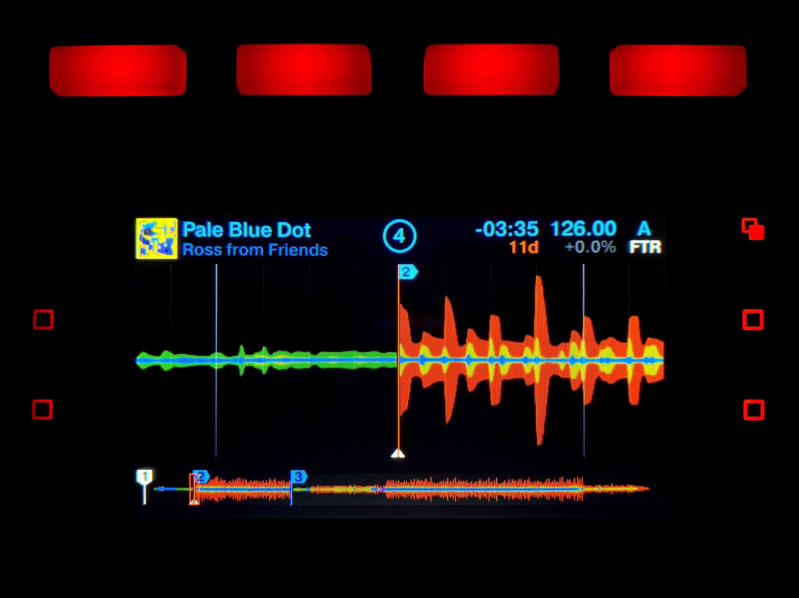
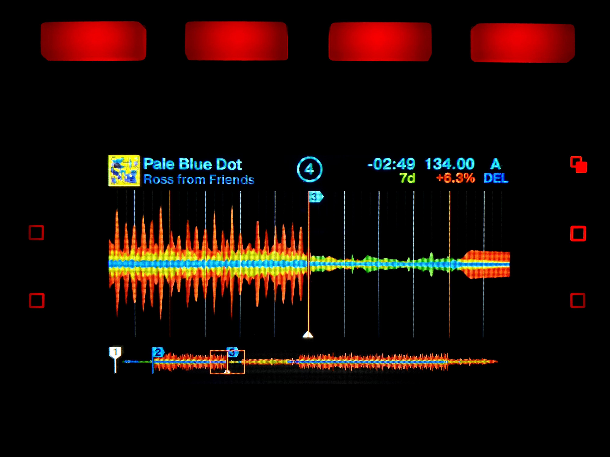
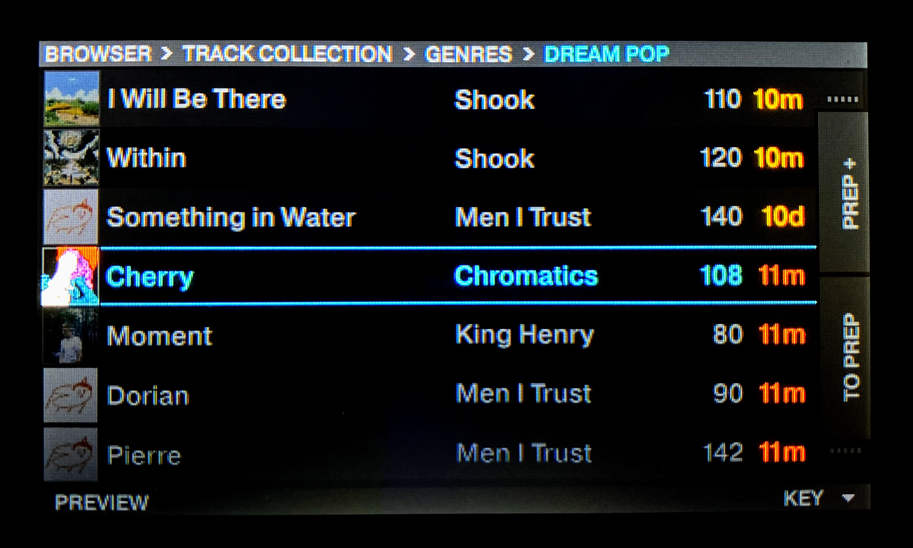
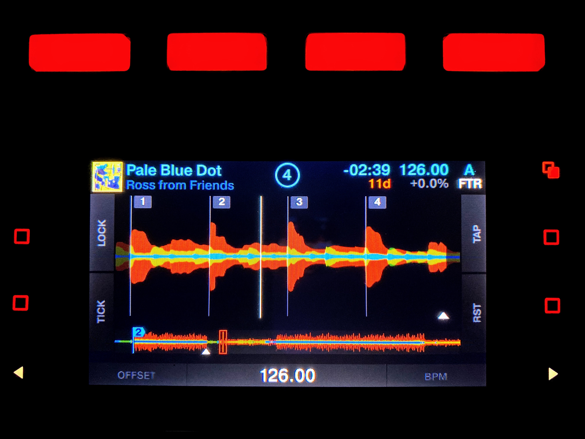
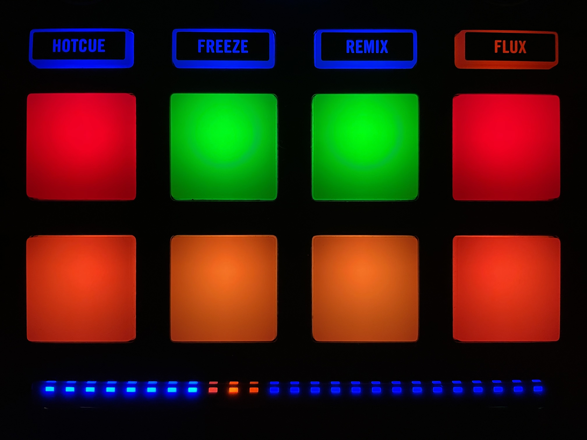
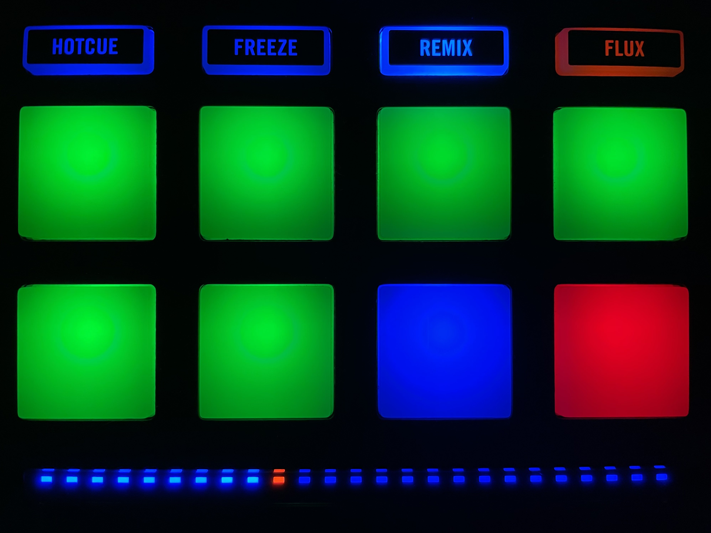
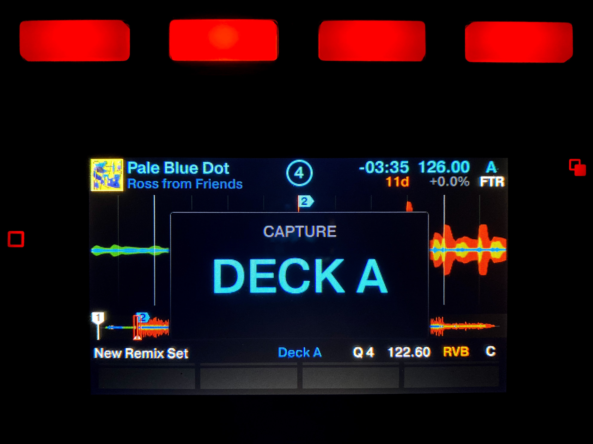

# Traktor S5 Mod

My dream is to DJ without a keyboard and mouse.

## Compatibility

Traktor Pro:

- 2.11.0
- 3.2.1
- 3.4.2

Note: I will only be actively supporting the latest version of Traktor Pro. Some features may not be available on older versions.

## Modifications

### Display

- Spectrum colors to distinguish highs, mids, and lows
- Downbeat and phrase markers (every 4 and 16 beats)
- Removed overlay hide delays
- Split-deck view on launch
- Color-coded deck headers
  - Dynamic Camelot key
  - Tempo bend
  - Mixer FX

### Transport

**Loop & Move:**

- TURN LOOP KNOB to adjust loop size
- PUSH LOOP KNOB to loop
- TURN BROWSE KNOB to seek (by loop size) or move the loop

**Cue:**

- Track stopped:
  - CUE to set a cue point [1]
  - HOLD CUE to play from cue point (press PLAY to continue playing after release)
  - SHIFT + CUE to set a cue point and play on release
- Track playing:
  - CUE to jump to cue point
  - SHIFT + CUE to jump to cue point and play on release
  - SHIFT + FLUX for flux reverse

**Global Tempo:**

- TURN TEMPO KNOB for coarse adjustment
- SHIFT + TURN TEMPO KNOB for fine adjustment

**Track Tempo & Key:**

- TURN BROWSE KNOB for coarse adjustment
- TURN LOOP KNOB for fine adjustment

**Reset:**

- SHIFT + BACK [<] on the left panel to unsync and unload all decks

[1] A cue point is either set manually or automatically when you trigger any hotcue.

### Browser

- PUSH BROWSE KNOB to open the browser
- Loading:
  - TURN BROWSE KNOB to browse
  - PUSH BROWSE KNOB to load the selected track [2]
- Sorting:
  - TURN LOOP KNOB to change sorting type
  - PUSH LOOP KNOB to invert sorting
- Preview:
  - SHIFT + PUSH LOOP KNOB to start playing selected track in preview mode
  - SHIFT + TURN LOOP KNOB to seek through preview track
- Preparation [3]:
  - TOP RIGHT □ to toggle selected track in and out of your preparation playlist
  - BOTTOM RIGHT □ to jump to preparation playlist

[2] Decks will be synced every time a new track is loaded, as long as at least one other deck is synced. For the optimal sync experience, set the master tempo to AUTO (by pushing the global tempo knob) and sync the first track as it is running. This will match the master tempo to the tempo of the running track.

This caveat makes AUTO sync behave better, since doing the initial sync on a running track causes the master to inherit the tempo of the running track.

[3] Preparation requires you to manually select a preparation playlist by right clicking on a playlist in the Traktor software.

### Beatgrid Edit

- From any track screen:
  - SHIFT + TOP LEFT □ to toggle beat grid edit mode
  - SHIFT + TOP RIGHT □ to set load marker at cursor
  - SHIFT + BOTTOM RIGHT □ to reset the load marker
- From edit mode:
  - TOP LEFT □ to lock edit mode
  - BOTTOM LEFT □ to enable tick [4]
  - TOP RIGHT □ to tap the beat [5]
  - BOTTOM RIGHT □ to reset BPM
  - SCREEN ARROWS [<] or [>] to halve or double the BPM
  - PUSH BROWSE KNOB to zoom in on a single beat
  - BACK [<] to switch between seek and edit mode
  - When in edit mode (back button blinking):
    - TURN BROWSE KNOB to adjust offset
    - TURN LOOP KNOB to adjust BPM
  - When in seek mode (back button not blinking):
    - TURN BROWSE KNOB to seek through track

[4] Tick plays an audible sound on every beat. This feature requires headphones routed from the monitor channel and for the track to be CUEd.

[5] Tap allows you to fix the beat grid alignment by tapping four consecutive beats while the song is playing.

### Jump Mode

Jump mode allows you to skip around the track using the pads. It also provides fine-tuned looping, allowing you to set the beginning and end of a loop. This means you can create loops of any beat size. If a loop is active, the jumping pads move the loop. Press "loop out" to exit the loop.

- FREEZE for jump mode
- SHIFT + FREEZE for freeze mode

Layout:

| -32 | loop in | loop out | 32 |
|:---:|:-------:|:--------:|:--:|
| -16 |    -1   |     1    | 16 |

Layout (with SHIFT held):

| -8 | loop in | loop out | 8 |
|:--:|:-------:|:--------:|:-:|
| -4 |    -2   |     2    | 4 |

### Loop Mode

Loop mode allows you to initiate loops using the pads. This works really well with FLUX enabled.

- REMIX for loop mode

Layout:

| 1/16 | 1/8 | 1/4 | 1/2 |
|:----:|:---:|:---:|:---:|
|  1   |  2  |  4  |  8  |

### Remix Mode

Remix mode allows you to capture multiple loops from a playing track deck and remix them.

If a remix deck already exists on that side, either focused or unfocused, remix mode will open its pads. If a remix deck does not exist, it will be created in the currently focused deck.

- SHIFT + REMIX for remix mode
- SHIFT + TURN LOOP KNOB to select the capture source [6]
- PRESS an empty PAD to record [7]
- PRESS a recorded PAD to play [8]
- SHIFT + PRESS a playing pad to stop it at the end of its loop
- BOTTOM LEFT □ to change quantize value
- RIGHT □s to page up and down

[6] This is the track deck you will be capturing. The loop indicator light will blink the color of the remix deck you are modifying.

[7] This will record the selected capture source by its loop size. This is easier to think about in a split view where the track deck is focused and the remix deck's pads are open.

[8] Make sure the remix deck is playing.

### Mixer FX

Mixer FX allow you to change the behavior of a deck's filter knob.

- BACK [<] to open the Mixer FX menu
  - TURN BROWSE KNOB to browse effects
  - PUSH BROWSE KNOB to set current effect on all decks
  - BACK [<] again to reset deck to filter
- SHIFT + FILTER ON to reset deck to filter

The four effects can be customized by going to [Settings] > [Mixer] > [Mixer FX]. Traktor must be restarted for the effect names to update.

## Installation

**Windows:**

1. Download or clone the repository.
2. Depending on your Traktor Pro version, copy the corresponding qml folder to:
   `C:\Program Files\Native Instruments\Traktor 2\Resources64`
   or
   `C:\Program Files\Native Instruments\Traktor Pro 3\Resources64`
   and replace all files.

**Mac:**

1. Download or clone the repository.
2. Depending on your Traktor Pro version, navigate to:
   `Applications/Native Instruments/Traktor 2`
   or
   `Applications/Native Instruments/Traktor Pro 3`.
3. Right click on Traktor and select `Show Package Contents`.
4. Manually copy each qml file to the appropriate folder in `Contents/Resources`.

Note: MacOS does not make this process easy because I chose to only upload files that I modified. Replacing will clobber the entire directory with my partial files. Merging will preserve newer items, but there is no guarantee that the mod files are newer than your current Traktor files.

## Credits

As far as I'm aware, all inputs and ouputs for these configuration scripts are completely undocumented. That means that this process requires tedious guess and checking with no guarantee of success. There are some features I simply would not have figured out on my own. A huge thanks to the following trailblazers:

- [Aleix Jiménez](https://www.patreon.com/supremeedition) makes an incredibly feature-rich Traktor mod. It's seriously light years ahead of mine and you should go support him on Patreon.
